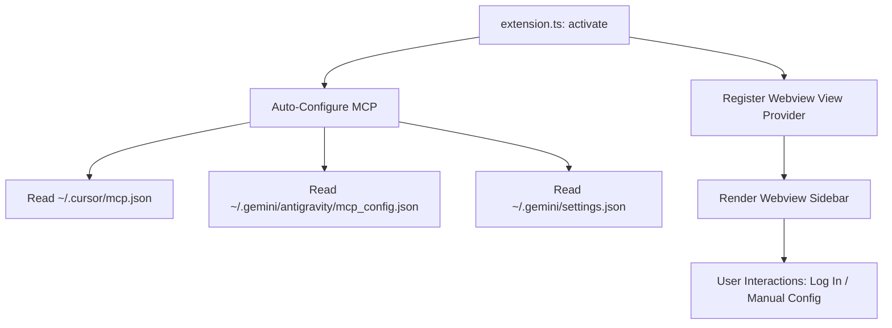

# AGENTS.md: AI Coding Agent Integration Guide

This document is for AI coding assistants (such as Antigravity, Claude, or Copilot) who are tasked with modifying, debugging, or enhancing this extension.

---

## Extension Architecture

The extension is built in TypeScript and uses VS Code's extension APIs to achieve zero-config MCP setups and user-friendly portal view rendering:

---

## Core File Map

* `package.json`: Contains the manifest, permissions, contributes configurations, and launch scripts.
* `tsconfig.json`: Controls TypeScript compilation targets.
* `src/extension.ts`: Activation hooks, configuration injector logic, and commands.
* `src/webviewProvider.ts`: Webview sidebar manager serving HTML/CSS/JS and routing communication events.
* `media/logo.png`: Main branded icon.

---

## Coding Rules and Best Practices

1. **Safety First**: When reading or writing configuration files (`mcp.json` / `settings.json`), always verify directory presence (`fs.existsSync`) and handle JSON parse errors gracefully to prevent corrupting existing user configurations.
2. **Minimal Dependencies**: Keep runtime NPM dependencies to zero. Rely on Node.js built-in core modules (`fs`, `path`, `os`, `child_process`) and VS Code APIs.
3. **Responsive Webviews**: CSS inside the webview must inherit standard VS Code variables (like `var(--vscode-editor-background)`, `var(--vscode-button-background)`) so it automatically transitions cleanly between dark and light themes.
4. **VSIX Exclusions**: Update `.vscodeignore` when adding source assets or compilation configurations to keep the final published `.vsix` file size low.
